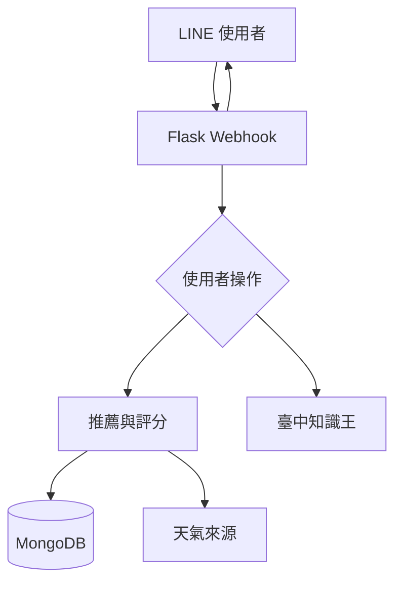

# Taichung Travel LINE Bot

一個以台中旅遊為主題的 LINE Bot。使用者可以依區域和類別取得景點、餐廳與點心推薦，也能遊玩「臺中知識王」。

> 本專案是課堂團隊作品的個人整理與改善版本。原始專案與共同開發資訊請見 [專案來源](#專案來源)。

## 功能

- 依台中行政區選擇推薦範圍
- 隨機推薦或依評分推薦美食、點心與景點
- 顯示地點、電話、地址、評分與地圖連結
- 景點查詢時顯示天氣摘要
- 提供地點評分功能
- 提供「臺中知識王」問答遊戲

## 技術

- Python 3.12
- Flask
- LINE Messaging API
- MongoDB
- Beautiful Soup / Requests
- Pytest / GitHub Actions

## 系統流程



## 我在整理版本中完成的改善

- 將資料庫連線字串與 LINE 憑證改由環境變數提供
- 將推薦／新增流程的狀態依使用者分開保存
- 驗證 webhook 簽章、區域、評分與 postback 參數
- 防止知識問答重複作答與無效題號
- 將評分更新改成 MongoDB 原子操作，降低同時寫入互相覆蓋的問題
- 為天氣逾時、空查詢結果和缺少圖片加入錯誤處理
- 移除 webhook 全文日誌，避免訊息內容進入伺服器紀錄
- 建立 17 項回歸測試與 GitHub Actions 測試流程

## 本機測試

這個 repo 不包含正式資料庫、LINE Channel 或任何憑證。只執行單元測試時，不需要連接真實服務。

```bash
python -m venv .venv
source .venv/bin/activate
pip install -r requirements-dev.txt
python -m pytest -q
```

測試使用 mock 取代 LINE、MongoDB 與外部天氣請求。真實服務的整合與正式部署不在此展示版本的驗證範圍內。

## 環境變數

若未來要接回測試服務，請在伺服器或本機環境設定下列變數。`.env.example` 只包含空白欄位，請勿提交真正的 `.env`。

| 變數 | 用途 |
| --- | --- |
| `CHANNEL_ACCESS_TOKEN` | LINE Channel access token |
| `CHANNEL_SECRET` | LINE Channel secret |
| `MONGODB_URI` | MongoDB 連線字串 |
| `ADMIN_USER_ID` | 選用，接收新增地點通知 |
| `PORT` | 選用，預設為 `5000` |

## 目前限制

- 對話狀態存放在單一 Python process 的記憶體，重啟後會消失
- 尚未加入跨 process 狀態儲存、rate limit 和 webhook event 去重
- 天氣資訊來自網頁解析，來源頁面改版時可能失效
- 尚未以真實 LINE Channel 與 MongoDB Atlas 完成整合測試
- repo 不包含原專案使用的資料庫資料，因此無法直接展示完整推薦內容

## 專案來源

本專案整理自課堂團隊作品 [IaminTaichung](https://github.com/yunhsuan0510/IaminTaichung)，原始整理基準為 commit `e8f24f8`。

- 原始共同開發者：[請在公開前填入姓名或 GitHub 帳號]
- 我在原始專案中的分工：[請在公開前填入實際負責功能]
- 我在此版本中的工作：安全設定整理、狀態隔離、輸入驗證、錯誤處理、評分一致性、測試與文件

請依實際貢獻修改以上內容。公開前也應先和共同作者確認程式公開、署名與授權方式。

## 授權

原始團隊 repo 未提供授權檔。本 repo 暫不附加開源授權；取得所有共同作者同意後，再加入一致的授權條款。
