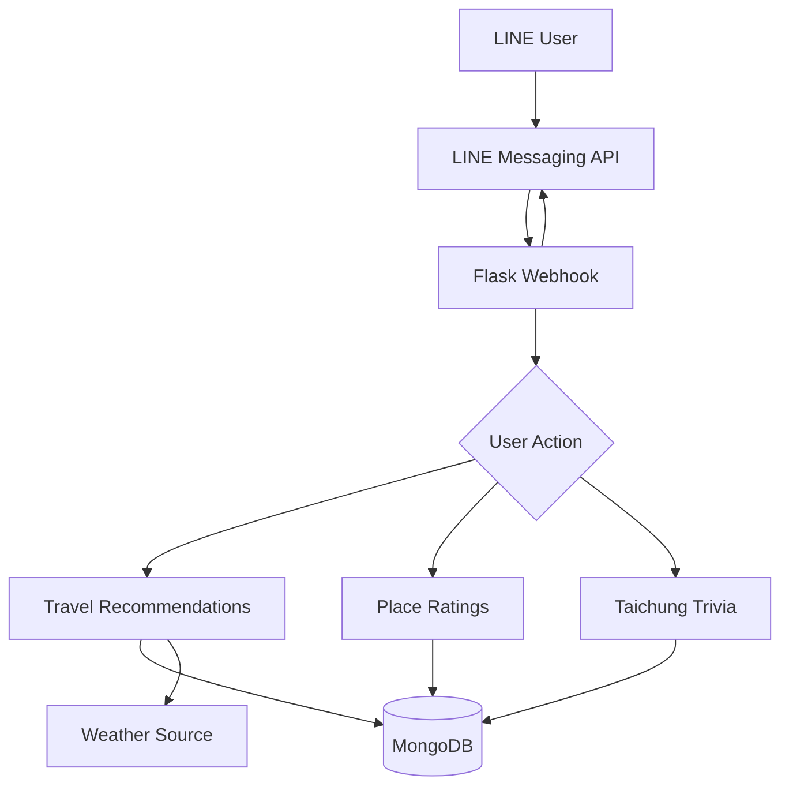

# Taichung Travel LINE Bot

A LINE Bot that helps users discover places to visit and food to try in Taichung. Users can choose an area and category, receive random or rating-based recommendations, check a short weather summary, rate recommended places, and play a Taichung trivia game.


## Features

- Select a district in Taichung as the search area
- Browse food, snack, and attraction recommendations
- Choose between random recommendations and top-rated results
- View place details, including address, phone number, rating, business hours, image, and map link
- Check a weather summary when browsing attractions
- Submit a rating for a recommended place
- Suggest a new place for review
- Play a five-question Taichung trivia game
- Use LINE Flex Messages, quick replies, buttons, and postback actions

## Tech Stack

| Category | Technology |
| --- | --- |
| Language | Python 3.12 |
| Web framework | Flask |
| Bot platform | LINE Messaging API |
| Database | MongoDB with PyMongo |
| HTTP and parsing | Requests, Beautiful Soup |
| Application server | Gunicorn |
| Testing | Pytest |
| Continuous integration | GitHub Actions |

## Architecture



## User Flow

1. Send `驚喜` for random recommendations or `推薦` for top-rated recommendations.
2. Select a district in Taichung.
3. Choose `美食`, `點心`, or `景點`.
4. Browse the returned place cards and open their map links.
5. Rate a place with the buttons in its recommendation card.
6. Send `知識王` to start the Taichung trivia game.

## Project Structure

```text
.
├── app.py                         # Flask application and LINE Bot logic
├── requirements.txt              # Runtime dependencies
├── requirements-dev.txt          # Development and test dependencies
├── .env.example                  # Environment variable template
├── tests/
│   └── test_app.py               # Automated tests
└── .github/
    └── workflows/
        └── tests.yml             # GitHub Actions workflow
```

## Local Setup

Create a Python virtual environment and install the dependencies:

```bash
python -m venv .venv
source .venv/bin/activate
pip install -r requirements-dev.txt
```

Run the automated tests:

```bash
python -m pytest -q
```

## Environment Variables

The repository includes an empty `.env.example` file. Service credentials should be configured through local or server environment variables.

| Variable | Description |
| --- | --- |
| `CHANNEL_ACCESS_TOKEN` | LINE Channel access token |
| `CHANNEL_SECRET` | LINE Channel secret |
| `MONGODB_URI` | MongoDB connection string |
| `ADMIN_USER_ID` | Optional LINE user ID for place suggestion notifications |
| `PORT` | Optional application port; defaults to `5000` |

## Project Credits

This repository is based on the class team project [IaminTaichung](https://github.com/yunhsuan0510/IaminTaichung)
